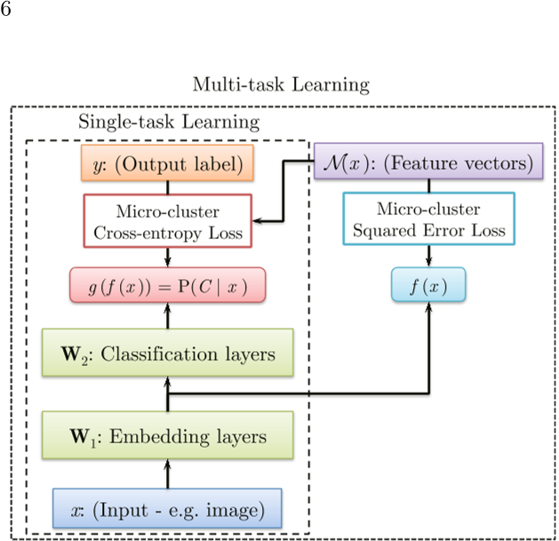
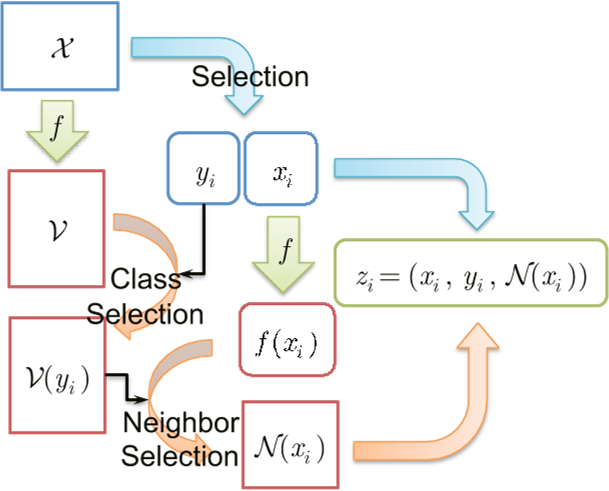

# Title

[**Deep Over-sampling Framework for Classifying Imbalanced Data**](https://www.semanticscholar.org/paper/Deep-Over-sampling-Framework-for-Classifying-Imbal-Ando-Huang/14860877a790d99296a990281b22e6b6a430b64f). Ando, S., & Huang, C. (2017).CoRR, abs/1704.07515. 
This paper belong to the topic [Imbalanced Classification](imclfi.md) in [paper-on-AI](../README.md) repository.

## Motivation
Class imbalance is a challenging issue in practical classification problems for deep learning models as well as traditional models. Traditionally successful countermeasures such as synthetic oversampling have had limited success with complex, structured data handled by deep learning models.  
In this paper, we propose Deep Over-sampling (DOS), a framework for extending the synthetic over-sampling method to exploit the deep feature space acquired by a convolutional neural network (CNN). Its key feature is an explicit, supervised representation learning, for which the training data presents each raw input sample with a synthetic embedding target in the deep feature space . which is sampled from the linear subspace of in-class neighbors. We implement an iterative process of training the CNN and updating the targets, which induces smaller in-class variance among the embeddings, to increase the discriminative power of the deep representation. We present an empirical study using public benchmarks, which shows that the DOS framework not only counteracts class imbalance better than the existing method, but also improves the performance of the CNN in the standard, balanced settings.

 
Fig. 1: CNN Architectures

 
Fig. 2: Deep Feature Overloading

 
Table 5: Baseline Comparison (Class-wise Recall)
