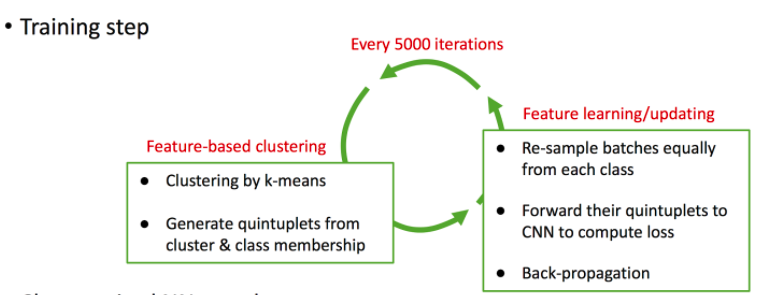
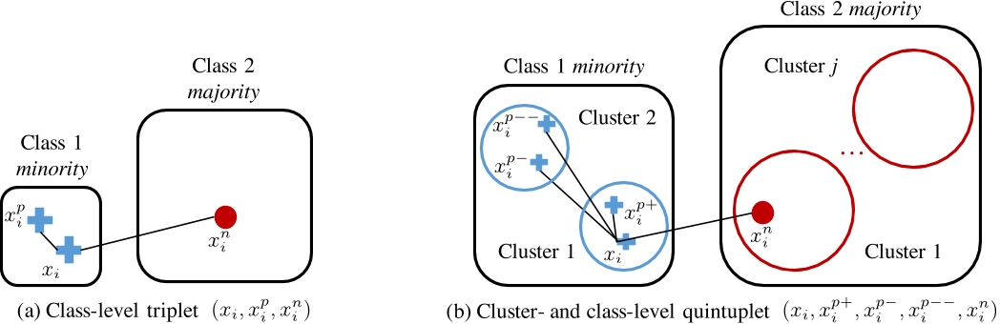
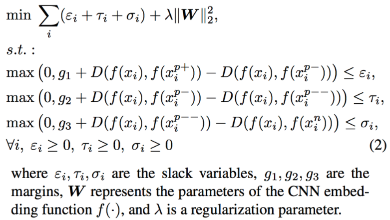
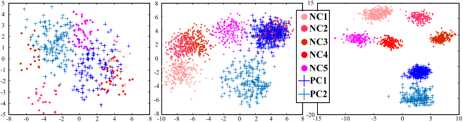
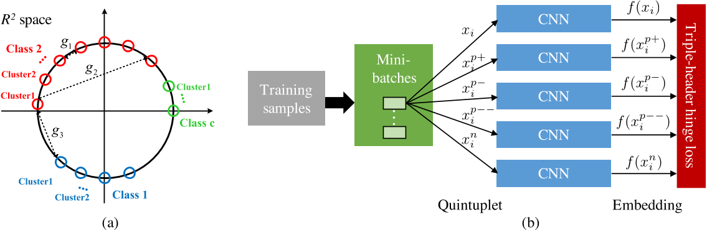
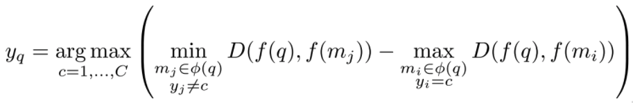

# Title

[**Learning Deep Representation for Imbalanced Classification**](http://www.cv-foundation.org/openaccess/content_cvpr_2016/papers/Huang_Learning_Deep_Representation_CVPR_2016_paper.pdf). Huang, Chen, et al. Proceedings of the IEEE Conference on Computer Vision and Pattern Recognition. 2016. 
This paper belong to the topic [Imbalanced Classification](imclfi.md) in [paper-on-AI](../README.md) repository.

## Motivation

Data in vision domain often exhibit highly-skewed class distribution, i.e., most data belong to a few majority classes,while the minority classes only contain a scarce amount of instances. 
Two representative methods to handle this problem: 
**Sampling Methods:**  
Oversampling, Undersampling, Informed Undersampling, Synthetic Sampling with Data Generation, Sampling with Data-Cleaning. Oversampling gives a high risk of overfitting to the imbalanced class, while Undersampling has a disadvantage that it does not make use of the full amount of data you have.  

**Cost-Sensitive Methods:**  
Instead of modifying the data, you consider the cost of misclassification. E.g. Modify learning rate for imbalanced examples. 

In this paper, A new **quintuplet sampling method** with the associated triple-header loss that **preserves locality across clusters** and **discrimination between classes**.  
Using the learned features, Classification can be simply achieved by a fast **cluster-wise kNN search** followed by a local large margin decision.

## Training: Quintuplet-based embeding

Instead of learning on class level, this method train the model on cluster level to handle the problem of data imblance.

The training procedure includes two alternative parts: k-mean clustering and quintuplet-based feature learning.

Following figure shows the difference between triplet and quintuplet embeddings, the latter one enforce both inter-cluaster and inter-class margins.

Figure 1. Embeddings by (a) triplet vs. by (b) quintuplet. We exemplify the class imbalance by two different sized classes, where the clusters are formed by k-means. Our quintuplets enforce both inter-cluster and inter-class margins, while triplets only enforce interclass margins irrespective of different class sizes and variations. This difference leads the unique capability of quintuplets in preserving discrimination in any local neighborhood, and forming a local classification boundary that is insensitive to imbalanced class sizes.

The examples below show the more compact cluster level embeding for quintuplet embeding.
 
Figure 3. From left to right: 2D feature embedding of one imbalanced binary face attribute using DeepID2 model(i.e., prior feature model), triplet-based embedding, quintuplet-based LMLE. We only show 2 Positive Clusters (PC) and 5 Negative Clusters (NC) out of a total of 499 clusters to represent the imbalance.

Figure 2. (a) Feature distribution in 2D space and the geometric intuition of margins. (b) Our learning network architecture.

## Testing: Cluster-wise kNN search 
Original KNN classifier does not satisfy the underlying equal-class density assumption hence, unfair to use it with imbalanced data.
Instead the KNN search is perform on Cluster level. 
For query q,
 - Find q’s kNN cluster centroids for all classes learned in the training stage.
 - If all the local k cluster neighbors belong to the same class, q is labelled by that class and exit.
 - Otherwise, label q using equation below.

## Thoughts
The idea of feature learning in cluster level and quintuplet embeding is interesting, but which one is more helpful for imblance data classification.

## Codes

## Blog

- Recent Exploration into Imbalanced Dataset Problem: https://blog.lunit.io/2017/05/18/recent-exploration-into-imbalanced-dataset-problem/

