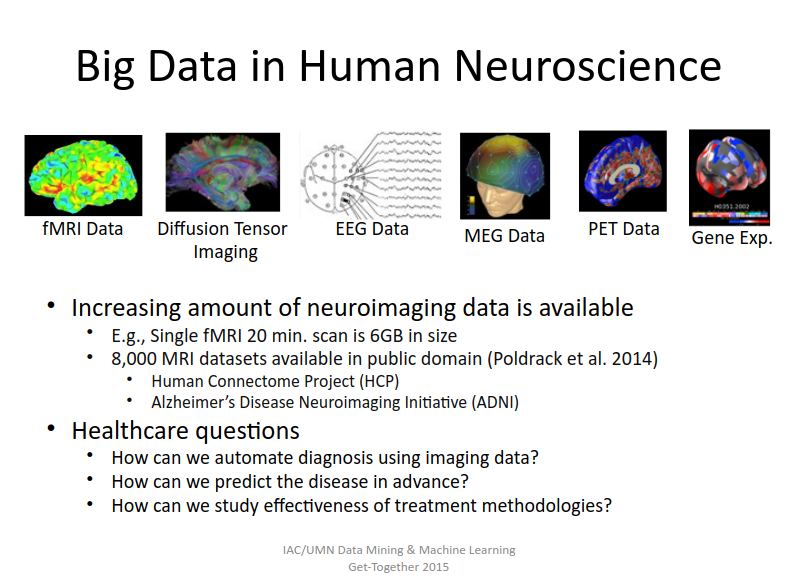
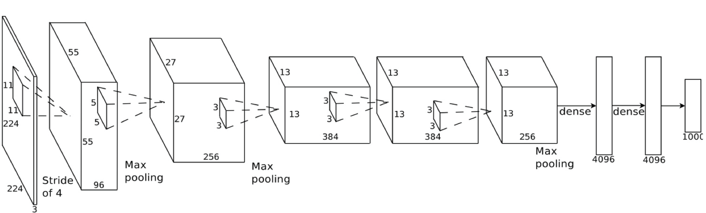

# Medical Image analysis using deep learning
Can be found in repository: [paper-on-AI](../README.md).

## overview
- [A Survey on Deep Learning in Medical Image Analysis](https://arxiv.org/pdf/1702.05747.pdf)
- [Challenges](https://grand-challenge.org/All_Challenges/)

## Medical Image analysis vs Nature image analysis
- precision over speed
- higher dimension(3D,4D)
- [one Example](surfer.nmr.mgh.harvard.edu/fswiki/FsTutorial/OutputData_freeview)
 

## Some examples
#### X-Rays(standford group)
- [MURA Dataset: Towards Radiologist-Level Abnormality Detection in Musculoskeletal Radiographs](https://arxiv.org/pdf/1712.06957.pdf)
- [CheXNet: Radiologist-Level Pneumonia Detection on Chest X-Rays with Deep Learning](https://arxiv.org/pdf/1711.05225.pdf)

#### MRI registration
- [An Unsupervised Learning Model for Deformable Medical Image Registration](https://arxiv.org/pdf/1802.02604.pdf)

#### MRI Segmentation
- [**3D fully convolutional networks for subcortical segmentation in MRI: A large-scale study**](https://arxiv.org/pdf/1612.03925.pdf)
- [HyperDense-Net: A densely connected CNN for multi-modal image segmentation](https://arxiv.org/pdf/1710.05956.pdf)
- [Neuroimage special issue on brain segmentation and parcellation - Editorial](https://www.sciencedirect.com/science/article/pii/S1053811917310091)
- [End-to-end learning of brain tissue segmentation from imperfect labeling](https://arxiv.org/pdf/1612.00940.pdf)
- [Scalable multimodal convolutional networks for brain tumour segmentation](https://arxiv.org/pdf/1706.08124.pdf)
- [NiftyNet: a deep-learning platform for medical imaging](https://arxiv.org/pdf/1709.03485.pdf)
- [DeepNAT: Deep Convolutional Neural Network for Segmenting Neuroanatomy](https://arxiv.org/pdf/1702.08192.pdf)

## Go deep
- [SqueezeNet: AlexNet-level accuracy with 50x fewer parameters and <0.5MB model size](https://arxiv.org/pdf/1602.07360.pdf)

