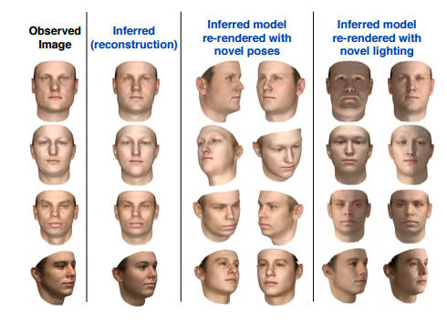
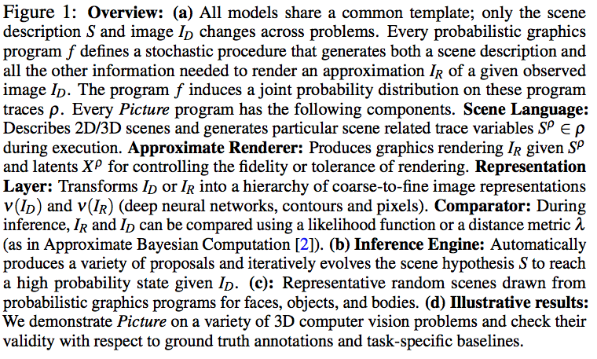
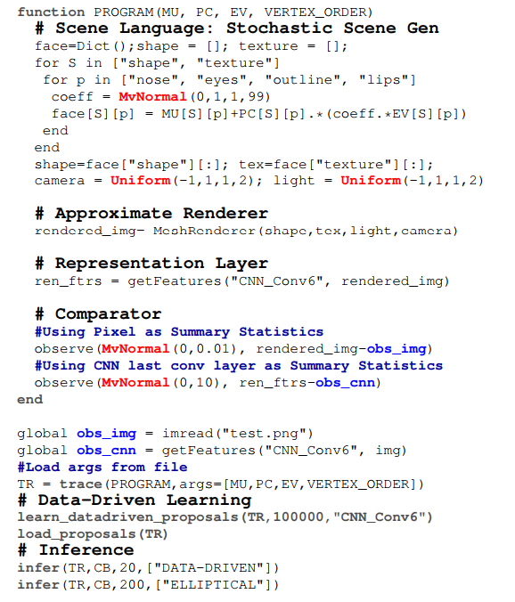
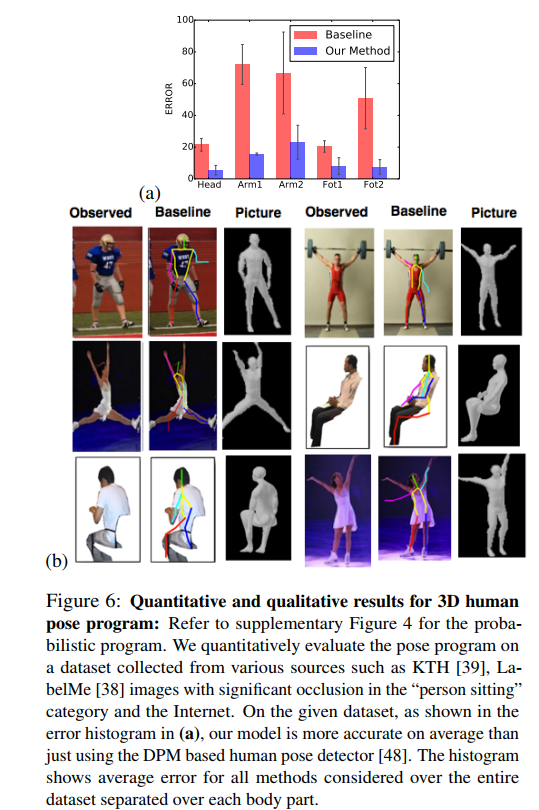

# Title

[**Picture: A Probabilistic Programming Language for Scene Perception**](http://mrkulk.github.io/www_cvpr15/). Kulkarni, Tejas D., et al. Proceedings of the IEEE Conference on Computer Vision and Pattern Recognition. 2015. 
This paper belong to the topic [Probabilistic programming language](ppl.md) in [paper-on-AI](../README.md) repository.

## Motivation

**Analysis by synthesis:** 
- To analyse something one approach is to find a mechanism that reproduces it
- In vision domain,to find a 3D model that will produce the pixel intensities in a given image. By finding the right model you can understand what the system is looking at - a cube, tilted at 45 degrees, say.  
- Sounds simple in theory, but in practice there are many 3D models that could have given rise to the pixel arrangement and so you need to use a statistical approach to find the best model.  

Researchers at MIT have created a **language**, Picture, based on Julia that makes it much easier to write programs that use probabilistic reasoning for 2D and even 3D based computer vision. 

## How does it work

**Picture code illustration for 3D face analysis:** 

- Running the program unconditionally (by removing observe’s in code) produces random faces. Running the program conditionally (keeping observe’s) on ID results in posterior inference. 
- The variables MU, PC, EV correspond to the mean shape/texture face, principal components, and eigenvectors respectively. These arguments parametrize the prior on the learned shape and appearance of 3D faces. 
- The observe directive constrains the program execution based on both the pixel data and CNN features.  

## Results
[See Demos at the bottom of the prject page](http://mrkulk.github.io/www_cvpr15/)

## Discussion
- Probabilistic programming does in 50 lines of code what used to take thousands
- **Inverse graphics:** inferring the three-dimensional shape of an object from 2D information
- “Picture provides **a general framework that aims to solve nearly all tasks** in computer vision,” says Jianxiong Xiao, an assistant professor of computer science at Princeton University, who was not involved in the work. “**It goes beyond image classification** — the most popular task in computer vision — and tries to answer one of the most fundamental questions in computer vision: What is the right representation of visual scenes? It is the beginning of modern revisit for inverse-graphics reasoning.”

## Codes
- MIT-Picture: https://github.com/mrkulk/MIT-Picture
## Blog
- [Picture - A Probabilistic Language](http://www.i-programmer.info/news/105-artificial-intelligence/8492-picture-a-probabilistic-language-.html)
- [Short probabilistic programming machine-learning code replaces complex programs for computer-vision tasks](http://www.kurzweilai.net/short-probabilistic-programming-machine-learning-code-replaces-complex-programs-for-computer-vision-tasks)
- [Review: Picture: A Probabilistic Programming Language for Scene Perception](https://theberkeleyview.wordpress.com/2015/07/05/cvpr-15-picture-a-probabilistic-programming-language-for-scene-perception/)

