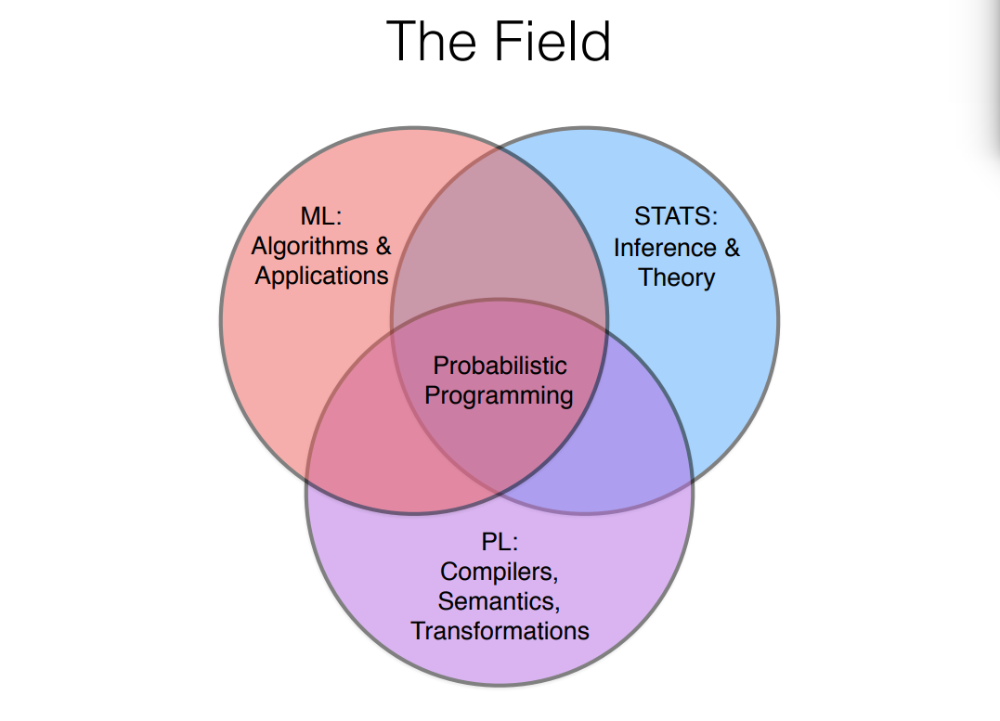
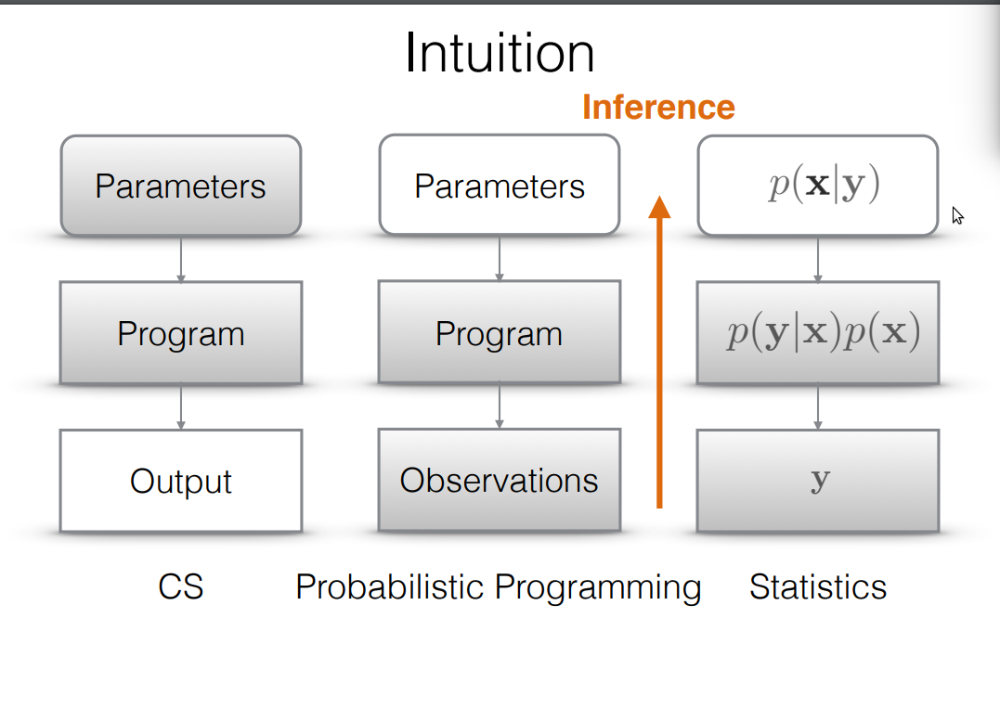

# Note for topic: Probabilistic programming language 
Can be found in repository: [paper-on-AI](../README.md).

Our minds are able to explore vast spaces of possible thoughts, perceptions, and explanations, and identify the probable ones in milliseconds. To emulate these capacities, we are building a new generation of computing systems that **integrate probability and randomness** into the basic building blocks of software and hardware. We have discovered that this approach leads to surprising new AI capabilities...[MIT probabilistic computing project](http://probcomp.org/)

Probabilistic programming is not about making what you already do faster or somehow better but instead about making it possible to do things that would otherwise be nearly impossible to do[...](https://media.nips.cc/Conferences/2015/tutorialslides/wood-nips-probabilistic-programming-tutorial-2015.pdf)

## What is probabilistic programming
 

Probabilistic programs are usual functional or imperative programs with two added constructs: 
- the ability to draw values at random from distributions, and
- the ability to condition values of variables in a program via observations.

[What is probabilistic programming](https://moalquraishi.wordpress.com/2015/03/29/the-state-of-probabilistic-programming) 
[A more detailed introduction](http://www.pl-enthusiast.net/2014/09/08/probabilistic-programming/)

## Let's read some papers to get a main idea
 - Human-level concept learning through probabilistic program induction ([Note](ppl_human_level_concep_learning.md))
 - Picture: A Probabilistic Programming Language for Scene Perception ([Note](Picture_PPL_for_Scene_Perception.md))

## [Why Probabilistic Programming Matters](https://plus.google.com/+BeauCronin/posts/KpeRdJKR6Z1)
- Probabilistic programming will unlock narrative explanations of data
- Probabilistic programming decouples modeling and inference
- Probabilistic programming enables more general, abstract reasoning

## books:
- [Probabilistic Models of Cognition](https://probmods.org)
- [Probabilistic Programming & Bayesian Methods for Hackers](http://camdavidsonpilon.github.io/Probabilistic-Programming-and-Bayesian-Methods-for-Hackers/#prologue)
## notes:
- [Probabilistic Programming](https://github.com/brylevkirill/notes/blob/master/Probabilistic%20Programming.md)
## slices:
- [Probabilistic Programming](https://media.nips.cc/Conferences/2015/tutorialslides/wood-nips-probabilistic-programming-tutorial-2015.pdf)
- [Tutorial on Probabilistic Programming in Machine Learning](http://www.robots.ox.ac.uk/~fwood/talks/2015/dagstuhl-probabilistic-programming-talk-2015.pdf)
- [Introduction to probabilistic programming](http://jamesrobertlloyd.com/talks/prob-prog-intro.pdf)
- [Probabilistic Programming](http://www.robots.ox.ac.uk/~fwood/anglican/teaching/mlss2014/slides/programming.pdf)
- [Probabilistic Programming](https://lirias.kuleuven.be/bitstream/123456789/464227/1/pp-tutorial-ki14.pdf)
