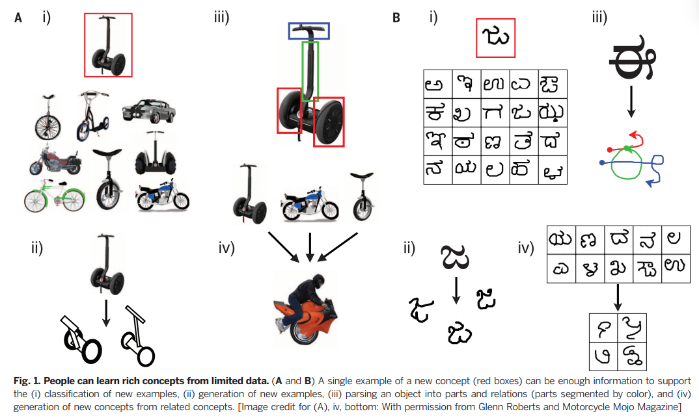
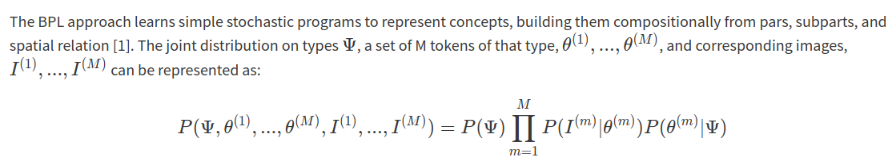
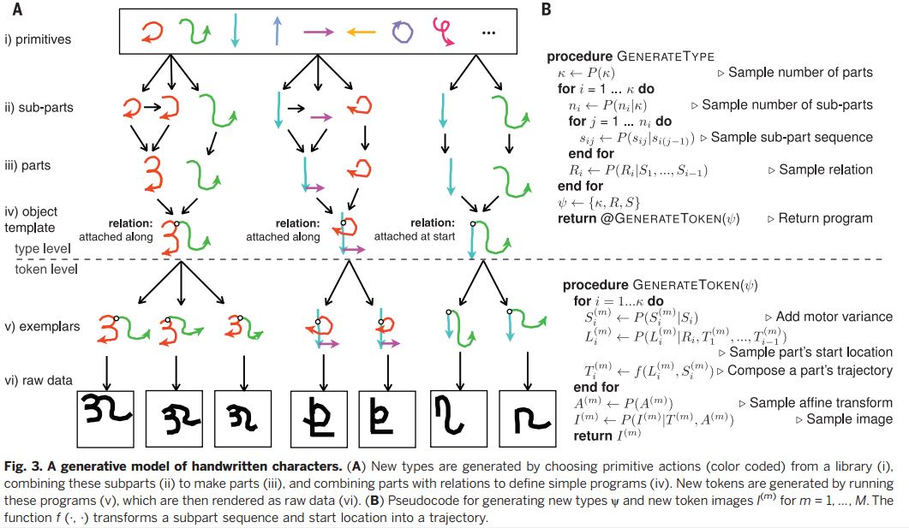
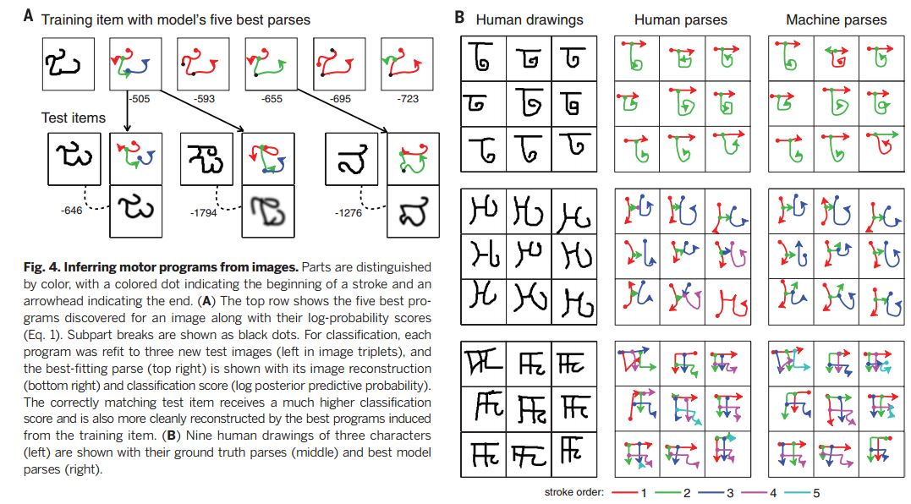
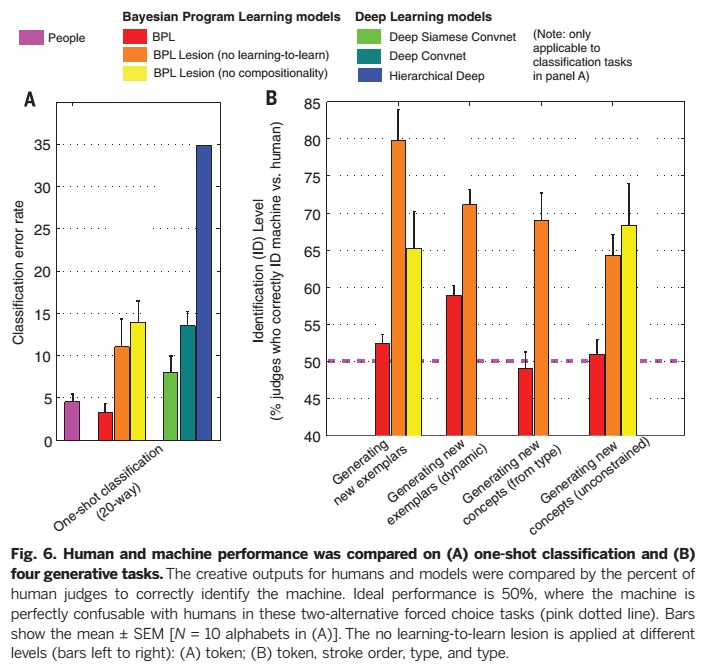
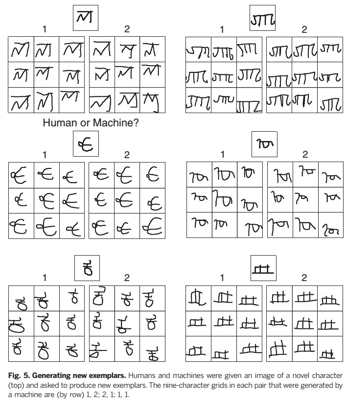
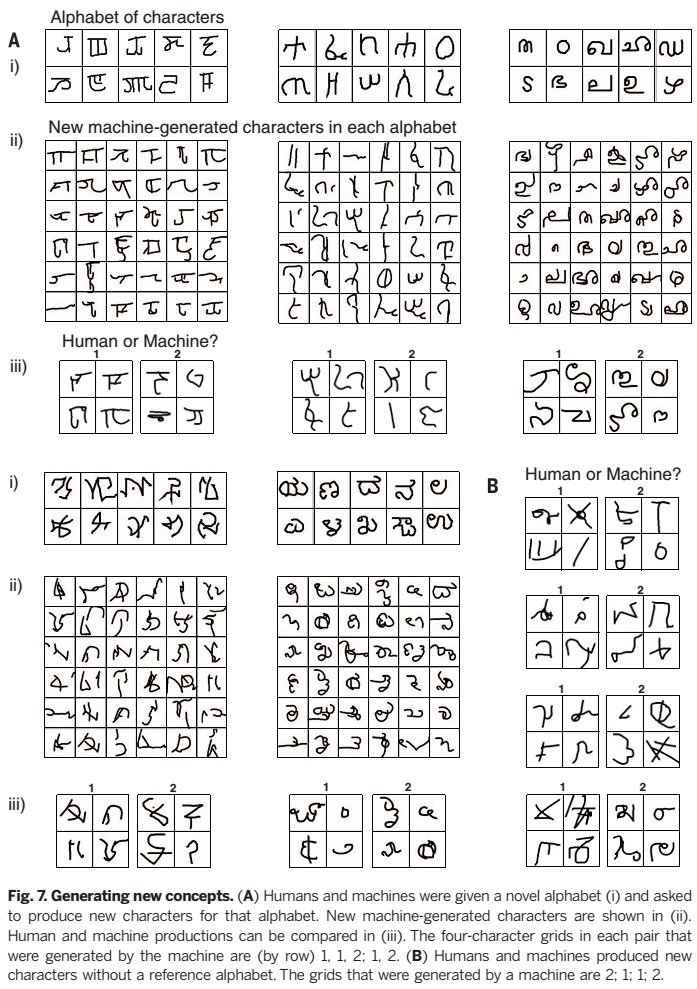

# Title

[**Human-level concept learning through probabilistic program induction**](http://www.sciencemag.org/content/350/6266/1332.abstract). Science, 350(6266), 1332-1338.
Lake, B. M., Salakhutdinov, R., and Tenenbaum, J. B. (2015). 
This paper belong to the topic [Probabilistic programming language](ppl.md) in [paper-on-AI](../README.md) repository.

## Motivation

 **People** 
  -Generalize successfully from just a single example to learn new concepts 
  -Use learned concepts in richer ways—for action, imagination, and explanation

 **Machine learning algorithms** 
  -Require tens or hundreds of examples to perform with similar accuracy

Given a single object, human can: 
  -Classify new examples, 
  -Generate new examples of similar type, 
  -Parse it into parts and understand their relation.

## Bayesian Program Learning

The paper introduces the Bayesian Program Learning (BPL) framework, which allows an algorithm to obtain the abilities described above. The BPL framework is based on three fundamental ideas: 
 -Compositionality 
 -Causality 
 -Learning to learn 

### Example with Hand Written Characters
Characters can be parsed based on strokes initiated by pressing a pen down and terminated by lifting it up (defined as “part” in figure below). Then, each stroke can be further separated by brief pauses of pen (“subpart” in figure below) 
If a character, “B”, is given: 
 -“B” can be parsed into two parts: one stick and another with two curves(**compositionally**). 
 -The second part can be further broken into a set of two half circles(**Causality**). 
 

 -Analyzing “B” learns new, primitives and relations, which can be later used to learn other characters easily(**Learning to learn**).

## Results

### Comparision with deep learning model on one-shot learning and generative tasks

### Generating new examples

### Generating new concepts

## Codes
- BPL model for one-shot learning: https://github.com/brendenlake/BPL

## Blog

- One Shot Generalization: https://casmls.github.io/general/2017/02/08/oneshot.html

