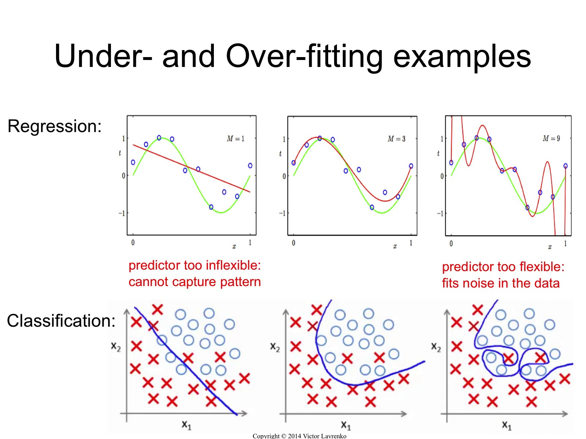
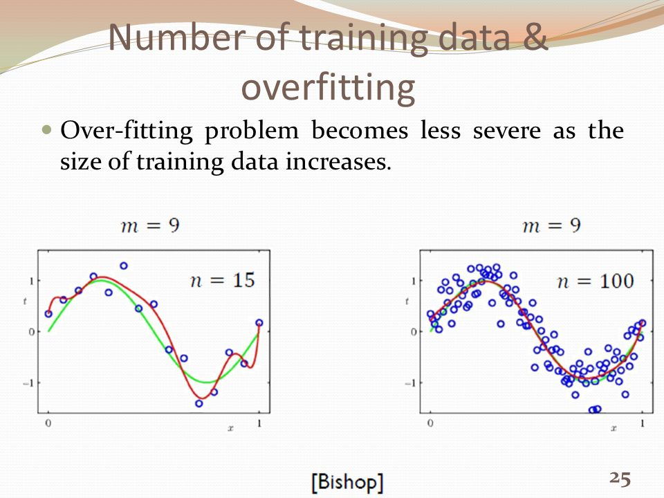
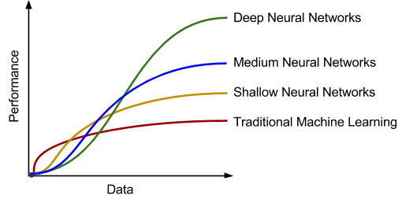
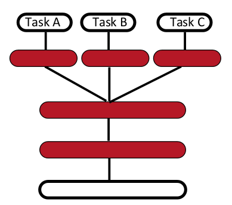
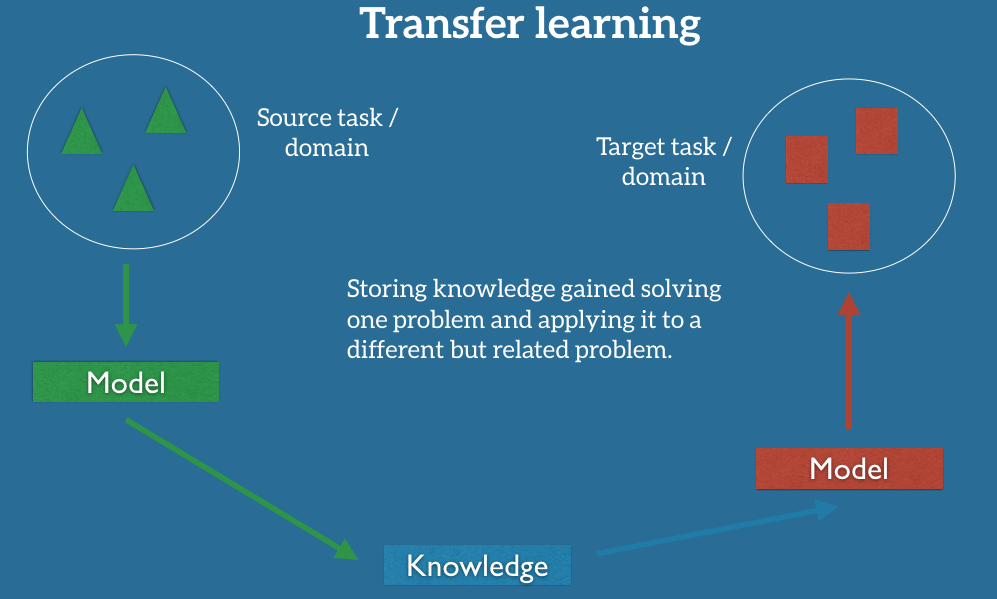
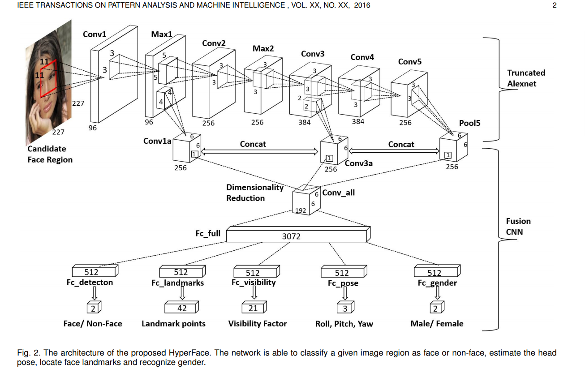
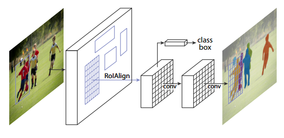

Can be found in repository: [paper-on-AI](../README.md).
### Underfitting and overfitting

### Another variable

### Why deep learning

### Find more data or ...
- data argumentation
- generating data
- **multi-task learning / transfer learning**

 

### transfer learning 
- [Transfer learning and domain adaptation](https://drive.google.com/open?id=1fqdpd0V3FXMoAIGUc3aE9L853oqTY0c8)

### multi-task learning
- [HyperFace: A Deep Multi-task Learning Framework for Face Detection, Landmark Localization, Pose Estimation, and Gender Recognition](https://arxiv.org/pdf/1603.01249.pdf)

- [Mask RNN](https://arxiv.org/pdf/1703.06870.pdf)  

- [An Overview of Multi-Task Learning in Deep Neural Networks](http://ruder.io/multi-task/)
1. Recent approaches have thus looked towards learning what to share and generally outperform hard parameter sharing
2. it is helpful to enable model to learn how the tasks should interact with each other(or add structure to the model).

## REFERENCES

##### transfer learning 
- [A survey of transfer learning](https://journalofbigdata.springeropen.com/track/pdf/10.1186/s40537-016-0043-6?site=journalofbigdata.springeropen.com)
- [Transfer learning and domain adaptation](https://drive.google.com/open?id=1fqdpd0V3FXMoAIGUc3aE9L853oqTY0c8)[second](https://drive.google.com/a/stradigi.ca/file/d/1xcbGAEivt7m_JDSExrbqiJcJtW7DgfdQ/view?usp=sharing)
frozone; fine-turn; domain; distillation; semi-supervised
- [Transfer Learning — The Next Frontier for ML](https://drive.google.com/file/d/1tpE7vcx8SuP5q5za-3_hZa7BDsOTW3-T/view)
- [Transfer Learning - Machine Learning's Next Frontier](ruder.io/transfer-learning/index.html)
##### multi-task learning
- [An Overview of Multi-Task Learning in Deep Neural Networks](http://ruder.io/multi-task/)
- [Multi-task Self-Supervised Visual Learning](openaccess.thecvf.com/content_ICCV_2017/papers/Doersch_Multi-Task_Self-Supervised_Visual_ICCV_2017_paper.pdf)
- [HyperFace: A Deep Multi-task Learning Framework for Face Detection, Landmark Localization, Pose Estimation, and Gender Recognition](https://arxiv.org/pdf/1603.01249.pdf)
- [Multi-task, Multi-lingual Learning](www.phontron.com/class/nn4nlp2017/assets/slides/nn4nlp-25-multitask.pdf)